<p align="center">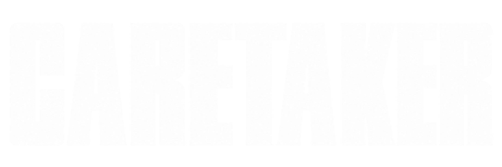</p>

# Caretaker

Caretaker is a control plane for agentic development. It decides where an AI
agent runs, what it can reach, whether its work is actually done, and what the
project looks like when you hand it to someone else.

Today it is two things:

- **A task board that refuses to let you sign off your own work.** A dashboard
  sits over it, along with a run log and an unattended loop. This part is built,
  and `install.sh` puts it into any repo.
- **The layers underneath it:** a sandbox, an egress allowlist, secrets
  handling, a drift gate and the harness seam. These live in `bin/`, are tested
  on their own, and are not wired together end to end yet.

> **About the name.** The project was called foreman, and the code still is.
> Installed files live in `ops/foreman/`, the config variable is
> `FACTORY_CONFIG`, containers are named `foreman-<runId>`, and run logs default
> to `$TMPDIR/foreman-runs/`. Every path and command in this README is the real
> one, so it still says `foreman` wherever the code does.

## Contents

- [Quick start](#quick-start)
- [The idea](#the-idea)
- [How it is built](#how-it-is-built)
- [What install gives you](#what-install-gives-you)
- [The task lifecycle](#the-task-lifecycle)
- [Gates and verdicts](#gates-and-verdicts)
- [The dashboard](#the-dashboard)
- [The run log](#the-run-log)
- [The unattended loop](#the-unattended-loop)
- [An agent run, through the harness](#an-agent-run-through-the-harness)
- [The sandbox and egress](#the-sandbox-and-egress)
- [Specs and the drift gate](#specs-and-the-drift-gate)
- [How the pieces are meant to connect](#how-the-pieces-are-meant-to-connect)
- [The web client](#the-web-client)
- [The board format](#the-board-format)
- [Configuration](#configuration)
- [Tests](#tests)
- [RULES.md](#rulesmd)

## Quick start

You need node and git. Nothing else is installed: no npm packages, no service.

```
bash install.sh /path/to/repo "Project Name"
cd /path/to/repo
node ops/foreman/board.mjs status       # show the board
node ops/foreman/board.mjs done T-001   # watch it refuse you
node ops/foreman/dashboard.mjs          # rebuild docs/board.html
```

`install.sh` refuses to run if `ops/foreman/` already exists in the target.
Copying over a live board is the one mistake here that loses work, so there is no
`--force`.

To bring an existing install up to date, use `bash install.sh --upgrade
/path/to/repo`. It replaces the tool files only, and never touches
`config.json`, `prompt.txt` or the board. It keeps what it replaced in
`ops/foreman/.upgrade-backup-<time>/`, and puts the old files back if the new
board cannot read yours.

## The idea

A board is only worth keeping if it can tell you something you did not already
believe. Most boards cannot, because the person who did the work is the person
who marks it done, and nothing in the tool disagrees.

```
$ node ops/foreman/board.mjs done T-001

  REFUSED — T-001 has not passed the gate.

  Missing: reviewer, qa

  Record verdicts first:
    node ops/foreman/board.mjs reviewer T-001 pass
    node ops/foreman/board.mjs qa T-001 pass

  This is enforced. Builder-says-done is a status report, not a completion.
```

That refusal is the whole idea. Everything else exists to make it readable, and
then to make the work behind it safe to hand to an agent.

## How it is built

The layers are built bottom-up. A good-looking UI over a harness that does not
work is the usual way projects like this die, so the UI comes last.

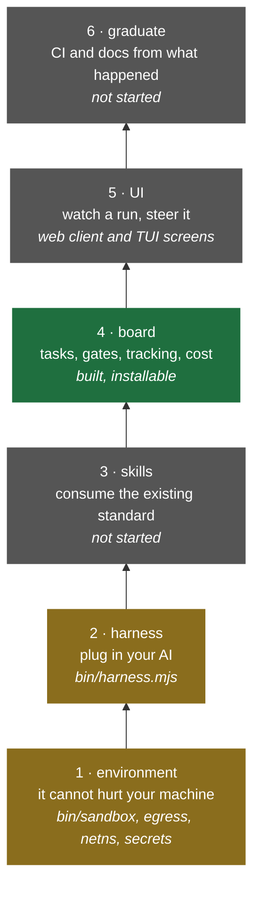

Green is built and installable. Amber has working code in `bin/` that is tested
but not installed or wired together. Grey is not built.

Two decisions hold the rest up. `docs/architecture.md` explains both.

- **The harness seam is `run(workspace, prompt, policy) -> { diff, transcript,
  verdict, cost }`.** Nothing above the harness imports a vendor's SDK, so a
  second vendor can fit without rework.
- **Egress, not isolation, is the security control.** A container with open
  internet can exfiltrate the repo, which is worse and quieter than damaging the
  machine. So the container gets no route out except through an allowlist proxy.

## What install gives you

`install.sh` copies four scripts, the rules, a prompt and a config into the
target repo, writes a starter board with one real task, and renders the page
once so you can see it worked.

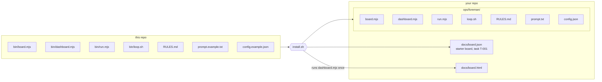

Once installed, each script owns one job and they share files rather than
calling each other. `board.json` is the source of truth. Everything else is
derived from it or appended beside it.

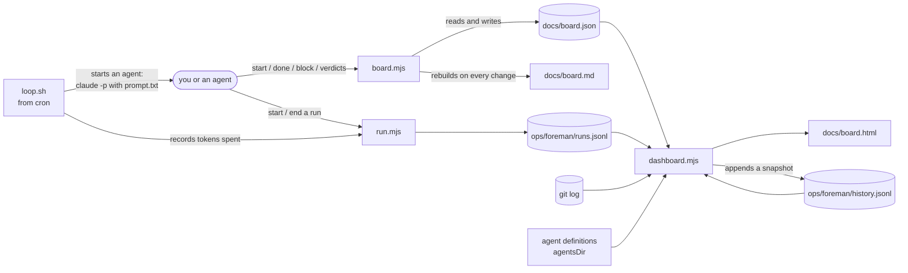

| File | What it does |
|---|---|
| `ops/foreman/board.mjs` | Moves a task, records a gate verdict, and refuses `done` until the gates pass. Rebuilds `docs/board.md` after every change. |
| `ops/foreman/dashboard.mjs` | Reads the board, git, the run log and agent definitions, and writes one self-contained `docs/board.html`. |
| `ops/foreman/run.mjs` | Appends one line per run start or end to the run log: what ran, on which task, and the tokens it spent. |
| `ops/foreman/loop.sh` | Runs one unattended pass from cron. |
| `ops/foreman/config.json` | Paths, the active phase, gates and columns. |
| `ops/foreman/prompt.txt` | What an unattended pass is told to do, and what it is forbidden to do. |
| `ops/foreman/RULES.md` | The rules the gates enforce. |
| `docs/board.json` | Your board. |
| `docs/board.html` | The page. |

## The task lifecycle

A task has one of five statuses. Every move goes through `board.mjs`, except
`dropped`, which `drop` sets with a reason.

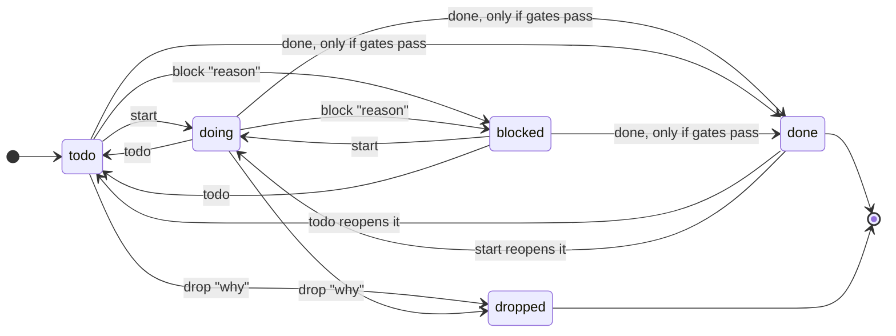

```
node ops/foreman/board.mjs start T-012            todo or blocked -> doing
node ops/foreman/board.mjs block T-012 "reason"   -> blocked, reason kept in the note
node ops/foreman/board.mjs todo  T-012            reset
node ops/foreman/board.mjs done  T-012            -> done, only through the gate
node ops/foreman/board.mjs note  T-012 "text"     append to the note
node ops/foreman/board.mjs status                 show the board
node ops/foreman/board.mjs build                  rebuild docs/board.md
```

Seven more commands record facts a human acts on. Each appends a record with
`by` (the config's `operator`, or your OS user) and a full ISO `at`:

```
node ops/foreman/board.mjs ask    T-012 "question"          questions[]; the Inbox shows it until answered
node ops/foreman/board.mjs answer T-012 q1 "text"           the answer, on that question
node ops/foreman/board.mjs triage T-012 accept|reject "why" triage[]
node ops/foreman/board.mjs spec-approve T-012               specReview[], keyed on the spec's git blob
node ops/foreman/board.mjs spec-reject  T-012 "why"
node ops/foreman/board.mjs pr     T-012 https://…           the PR link
node ops/foreman/board.mjs drop   T-012 "why"               -> dropped, with the reason
```

Spec approval is tied to the spec's content: edit the spec and the approval no
longer matches it. Only a spec with a ```` ```spec ```` block governs anything,
so only those can be approved.

A few details matter:

- **`done` is the only guarded move.** The gate is checked on the transition,
  not on the status you are coming from, so a task can reach `done` from
  anywhere as long as its verdicts pass.
- **`done` stamps the date.** `completed` is set to today. Any move away from
  `done` clears it, so a reopened task stops counting as closed.
- **Blocking records why.** The reason is stored in `blockedReason` and appended
  to the task's note. Moving off `blocked` clears `blockedReason`.
- **`dropped` is scope a decision deleted.** It is neither failure nor
  completion. It leaves the progress denominator entirely, so dropping work
  moves the percentage because the work is gone, not because anything was built.

## Gates and verdicts

A gate is a named verdict, `pass` or `fail`, that someone records against a
task. There are three: `reviewer`, `qa` and `security`.

```
node ops/foreman/board.mjs reviewer T-012 pass "read the diff"
node ops/foreman/board.mjs qa       T-012 fail "suite red on the edge case"
node ops/foreman/board.mjs qa       T-012 pass "fixed and re-run"
```

**Verdicts append; they never overwrite.** `gate.qa` is always the latest
verdict, and every earlier attempt sits in `gate.qa.history`, oldest first. A
task that failed qa three times and then passed reads as four attempts, not one
clean pass. That is what makes rework measurable.

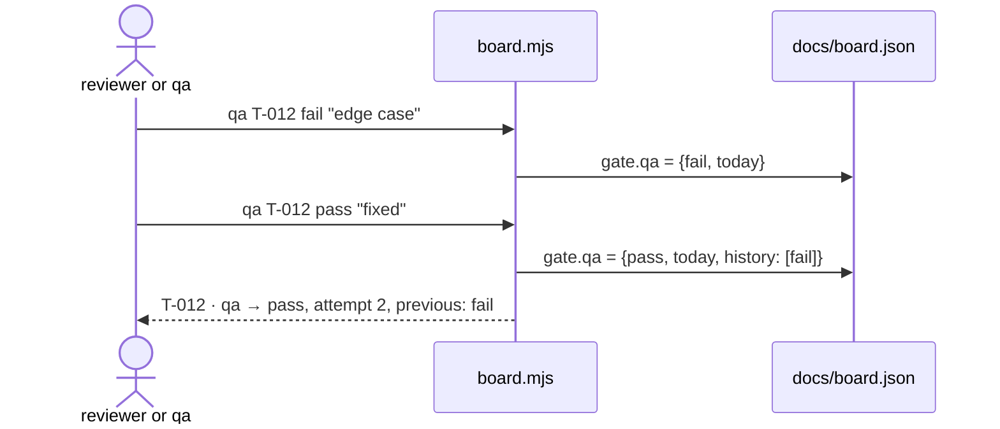

When you run `done`, the board works out which gates this task needs and
refuses unless the latest verdict on each is `pass`:

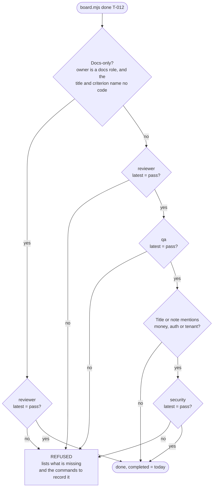

Things to know about the gate as it is today:

- **It checks that verdicts exist, not who wrote them.** The tool cannot tell a
  builder from a reviewer. The rule that nobody closes their own work is kept by
  the people and agents using it, and the gate makes skipping it visible.
- **`done` does not read `gates` in `config.json`.** That list drives what the
  dashboard draws. The rules above are hardcoded in `board.mjs`, and making the
  two agree is a known, separate fix.
- **The docs-only roles and the security keywords are hardcoded** in
  `board.mjs`. They came from the project this tool was extracted from.

## The dashboard

One HTML file. No CDN, no script, no build step. Open it from disk, copy it to a
server, or attach it to a message.

**Two progress numbers, because one of them lies.** Counting tasks treats
"rotate the production key" and "fix a typo" as equal, so a board reads high
exactly when the cheap work is done and the expensive work is not. The bar is
effort, weighted by the board's own estimates, and a notch marks the task count.
The gap between them is the honest part.

**An ETA that says "no rate" instead of guessing.** It divides remaining effort
by effort actually closed per calendar day. Idle days stay in the divisor on
purpose: the question is when this lands, not what a good day looks like.

**A gate rail per task.** Each gate gets one segment: filled on a pass, red on a
fail, hollow when it has not run. Before this, a task sitting at "doing" with
three passes recorded looked identical to one with none.

**Counts that explain a stall.** The page shows how many tasks are held at a
gate, how many are blocked, and how many have no acceptance criterion at all.
Nobody can close those last ones, and a board full of them only goes down.

**Rework, measured.** Because verdicts append, the stats tab reports first-pass
rate and rework rate. Once a run log exists, it also reports the tokens spent on
tasks that failed a gate and ran again.

**Which model each role runs on.** If `agentsDir` points at agent definitions
with a `model:` line in their frontmatter, the page lists them, so spend routing
is visible instead of folklore.

Each rebuild also appends a snapshot to `history.jsonl`, which is where the
trend lines come from.

### And what it will not tell you

These are printed on the page, next to the numbers they qualify:

- **What is executing right now**, unless something appends to `runs.jsonl`.
  The page says so rather than animating a pulse over a snapshot.
- **Effort actually spent.** The board stamps a close date and no start date,
  so elapsed time is calendar days from the first commit naming a task. That
  measures how long work sits, which is what the ETA depends on. It is not hours
  worked.

A dashboard that implies precision it does not have is worse than the gap it
hides.

## The run log

`run.mjs` writes down what ran and what it cost, because neither can be
recovered afterwards. An agent reports its token use once, when it finishes,
and if nothing records it the number is gone.

```
node ops/foreman/run.mjs start --name qa --task T-277 --note "money gates"
node ops/foreman/run.mjs end   --name qa --task T-277 --tokens 356251 --state done
node ops/foreman/run.mjs end   --name qa --task T-277 --state failed --note "OOM"
```

- **Append-only, one JSON object per line.** A start and an end are two
  separate facts. A crashed run leaves a start with no end, which is exactly
  what you want to see.
- **The breakdown matters more than the total.** Input, cache reads, cache
  writes and output are kept separately. 380k tokens of cache reads is a
  context problem, while 380k of output is a work problem, and they need
  different fixes.
- **Provenance is a field.** `--src live` means the line was written as the
  work happened. `--src reconstructed` means someone wrote it later. The
  dashboard labels reconstructed rows rather than averaging them in silently.

## The unattended loop

`loop.sh` runs one pass from cron, so work continues when nobody has a session
open.

```
crontab -e  ->  */30 * * * * /path/to/repo/ops/foreman/loop.sh
```

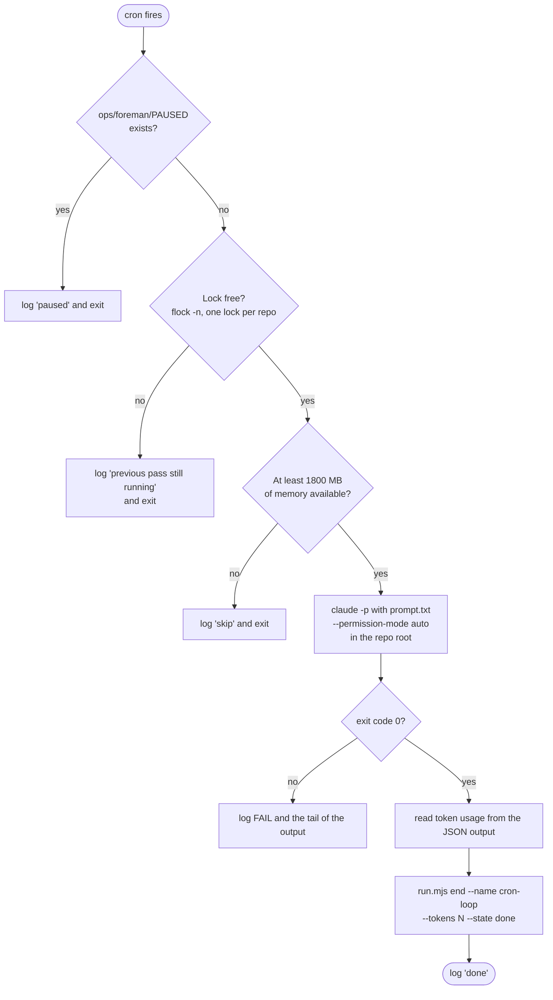

Each guard is there because of something that went wrong:

- **The pause file.** `touch ops/foreman/PAUSED` stops it with no crontab
  edit, and `ls` shows whether it is paused.
- **A non-blocking lock.** A pass can outlast the interval. Without the lock,
  fires stack until the machine dies. The lock is namespaced by repo path, so
  two projects can loop on one machine.
- **A memory gate.** If a pass starts while memory is tight, it gets killed
  mid-write, and a half-written file is what gets committed by accident.
  Skipping a pass costs nothing.
- **A token log.** Every pass records what it spent, so unattended cost shows up
  on the dashboard rather than on a bill.

What `prompt.txt` forbids matters more than what it asks for. The pass picks the
next unblocked task, does it, commits with explicit paths and rebuilds the
dashboard. It must not deploy, merge to the protected branch or push through a
red suite. Those are the irreversible ones, and none of them should happen with
nobody watching. When a task needs a decision or a credential, the pass writes
that into the task note and moves on.

**The loop runs the agent on the host, not in the sandbox.** It calls the
`claude` CLI directly in your repo. The sandbox and harness below are how that
changes, and they are not wired into the loop yet.

## An agent run, through the harness

`bin/harness.mjs` is the seam every agent run is meant to go through:

```
run(workspace, prompt, policy) -> { diff, transcript, verdict, cost }
```

It snapshots the workspace, runs an agent CLI inside a container, snapshots
again, and reports what changed, what was said, how the run ended and what it
cost.

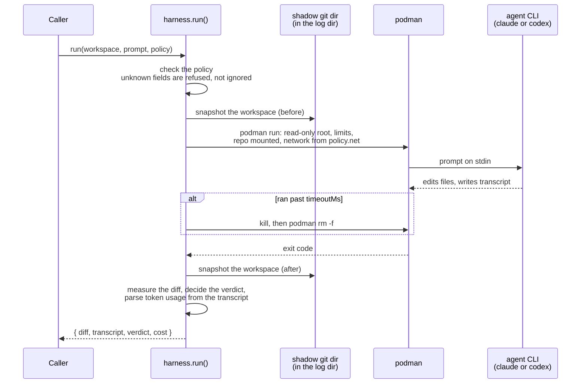

**The verdict is how the run ended, not whether the work is good.** A hung run
and a bad answer look alike from above, and keeping them apart is the point. The
state is one of four:

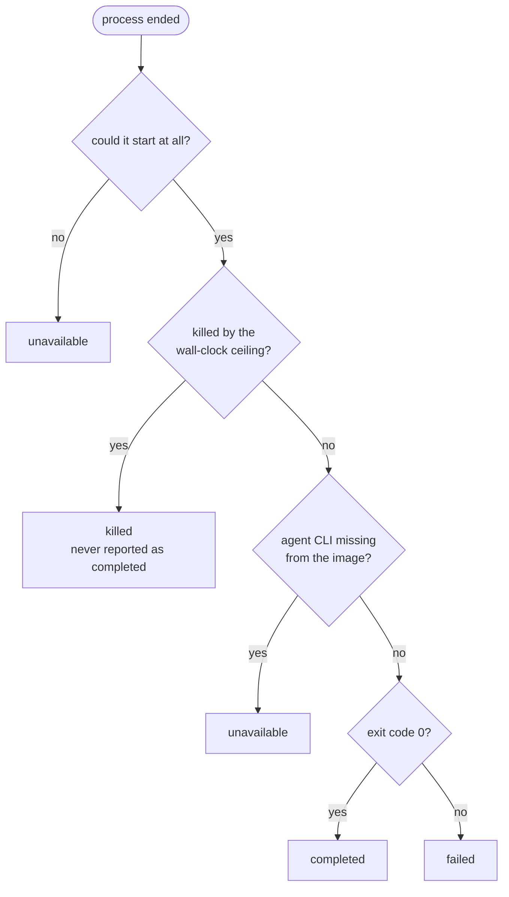

What the defaults are, and why:

| Policy | Default | Why |
|---|---|---|
| `adapter` | `cli` | Subscription auth lives in the CLI. The `sdk` adapter is registered but not implemented, and says so by name rather than faking a result. |
| `cli` | `claude` | `codex` is the other preset. |
| `sandbox` | `podman` | `none` runs on the host with no isolation, is never the default, and always warns. |
| `net` | `none` | No route off the host. A real CLI then cannot reach its model, and the run says so in `verdict.warnings` rather than opening the network for you. |
| `timeoutMs` | 15 minutes | A run past it is killed, and the container is removed explicitly. |

Limits the kernel cannot enforce, such as CPU without a delegated cgroup
controller, are dropped and recorded in `verdict.warnings`. A ceiling you believe
in and do not have is worse than none. `cost` reports `null` when the CLI printed
no usage, because null means unknown, not zero.

```
node bin/harness.mjs adapters
node bin/harness.mjs run --workspace DIR --prompt-file F [--cli claude|codex] [--timeout MS] [--json]
```

## The sandbox and egress

The environment layer is what makes it safe to let an agent run unattended.
Each piece is a separate script in `bin/`:

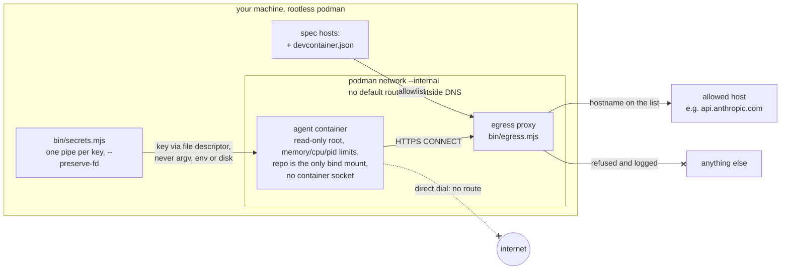

- **`sandbox.mjs`** runs a command in a rootless podman container with enforced
  limits and a read-only root, and never mounts the container socket. Rootless
  means an escape lands as an unprivileged user rather than root.
- **`egress.mjs`** is a CONNECT proxy that allows only the hosts a spec
  declared, and logs every refusal. It matches hostnames, not IP ranges, because
  model APIs and package registries sit behind CDNs whose addresses move. It
  does not intercept TLS.
- **`netns.mjs`** is what makes the proxy mandatory. A proxy setting alone is
  advisory, since a process can ignore it and dial out directly. So the agent
  container goes on a podman `--internal` network with no route off the host,
  and the proxy is the only thing it can reach. It also carries the attack
  suite that tries to get around this with real containers.
- **`secrets.mjs`** gets an API key into the container through one anonymous
  pipe per secret. It never passes through `-e`, where `podman inspect` and `ps`
  can read it. It also redacts anything that writes a log.

The harness takes a `net` policy, so a run can be placed on the internal
network. Starting the proxy and network for a run is still a manual step.

## Specs and the drift gate

A spec is a markdown file with a small `spec` block at the top. It declares the
two things no existing standard does: which hosts the code may reach, and which
paths the document governs. Everything else about the container comes from
`devcontainer.json`.

````
```spec
hosts:   api.example.com
governs: src/lib/pricing*, src/app/api/checkout/**
```
````

`bin/drift.mjs` is the drift gate. When a governed path changes and its spec
does not, it blocks.

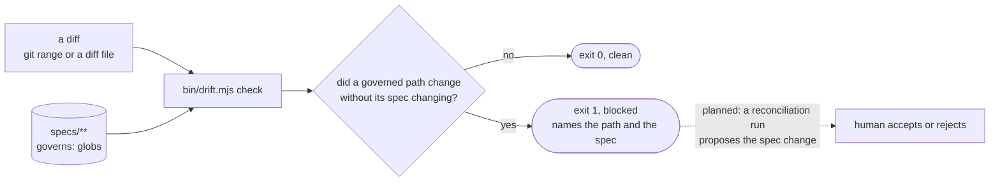

- **It detects and refuses, and never edits a spec.** A spec that follows the
  code automatically is a mirror, and a mirror can never say the code is wrong.
- **No model is involved.** A gate must answer the same way twice, or the first
  time it is inconvenient someone re-rolls it until it passes. The tests assert
  byte-identical output on the same input.
- **Ownership is by glob for now.** That is knowingly crude, and the source
  lists the cases it gets wrong. A code-graph resolver can replace it behind the
  same interface.

```
node bin/drift.mjs check [--git HEAD|A..B] [--diff FILE] [--task T-1] [--run r_x]
node bin/drift.mjs map
node bin/drift.mjs explain <path>
```

## How the pieces are meant to connect

Each layer works and is tested on its own. The end-to-end path is not wired
yet. This is where it is going, with solid lines for what exists and dotted
lines for what is planned:

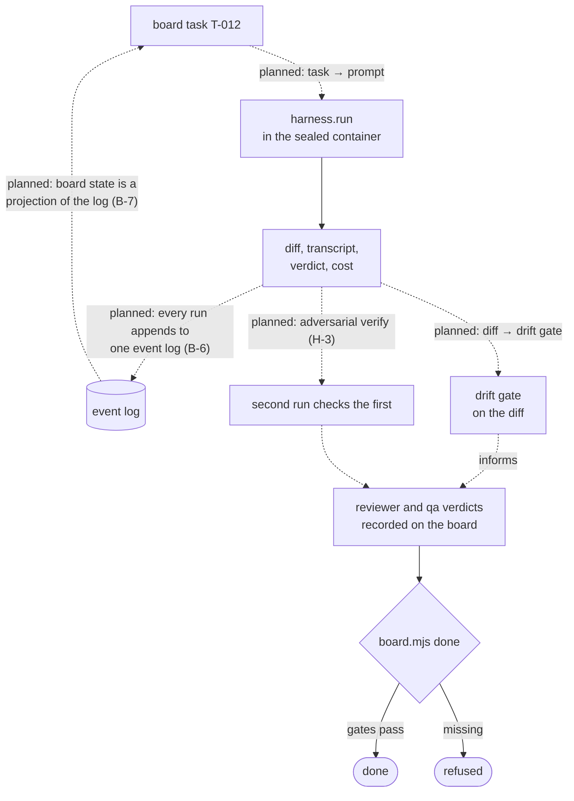

`docs/board.json` in this repo tracks each of these steps as its own task.

## The web client

A local page for the person at the machine: what is running, what is stuck, what
it cost, and an Inbox of the decisions only a human can make. It is a client of
the core, never a peer. If it and the CLI ever disagree, the web client is the
one that is wrong. The decision record is
`docs/decisions/0002-an-optional-web-client.md`; the product and technical specs
are in `specs/foreman-web/`.

```
npm --prefix web ci && npm --prefix web run build   # once; optional
node bin/serve.mjs ops/foreman/config.json          # prints a sign-in URL once
```

Open the printed URL. From another machine, tunnel: `ssh -L 7420:127.0.0.1:7420
you@box`. Without the build, the server still answers the API under `/api/v1`
and links `docs/board.html`.

The same project in a terminal, over SSH, with nothing listening on a port:
`node bin/tui.mjs ops/foreman/config.json`. Four screens (1 Runs, 2 Board,
3 Inbox, 4 Metrics), read from the same read model, and `:` for the commands
core offers on the selected work item.

The pages are Dashboard, Activity (the work board, by lifecycle stage or by
status), each work item, Inbox, Runs and Run detail, Agents, Specs & drift,
Metrics, Settings and Getting started. Ctrl-K opens a command menu that lists
pages, work items, runs and, on a work item, the commands core offers for it
right now.

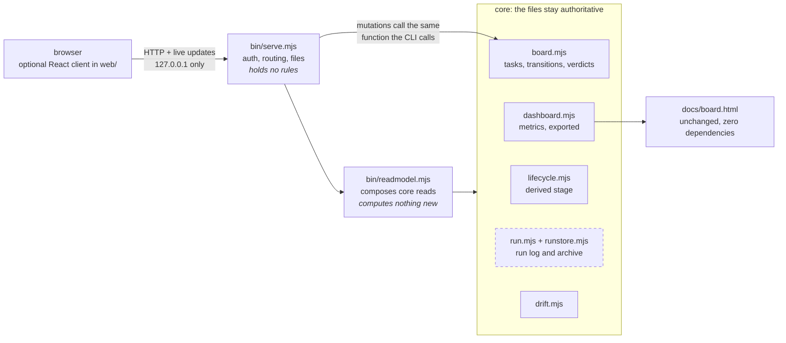

It keeps the three reasons the terminal UI was preferred, rather than waving
them away:

- **No daemon.** `node bin/serve.mjs` runs in the foreground and stops on
  Ctrl-C. It writes no pidfile and stores nothing the files cannot rebuild.
- **No port anyone else can reach.** It opens one port, on 127.0.0.1, only
  while it runs. Any other bind is refused. Remote access is `ssh -L`.
- **Auth anyway.** A one-time token in the printed URL becomes a
  `SameSite=Strict` cookie, with exact `Host` checks and a strict CSP, because
  agent-written text is the realistic injection path. That makes it an auth
  change, so it needs `security` as well as `reviewer` and `qa`.

A work item's stage is derived from what has been recorded, never declared:

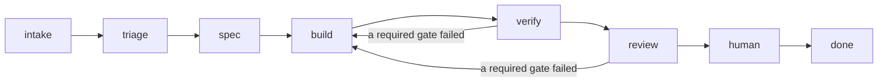

Each stage carries the recorded fact that put the item there, so a stage cannot
be a status report.

What it does not change:

- **The files stay authoritative.** There is no database. Every button calls
  the same core function the CLI calls, and core re-checks.
- **The browser cannot record a verdict.** A one-click pass is the rubber stamp
  ADR-0001 rejects, so reviewer, qa and security stay out of it in v1.
- **`docs/board.html` stays** zero-dependency and offline, built from the same
  metric functions the server uses, so the two cannot disagree.
- **The install stays dependency-free.** The optional React client in `web/`
  holds the only npm dependencies in the repo, and nothing in `bin/` or
  `ops/foreman/` imports it. `bin/web-boundary.test.mjs` fails if `web/src`
  imports from `bin/`, names a gate or stage outside its one label module,
  uses `innerHTML`, makes an external request or holds a color outside
  `web/src/theme.css`.
- **The terminal UI is not replaced.** Over SSH, with nothing listening, it is
  still the right tool.

Pages over board data are complete today. Run pages fill in as runs are
recorded: until the harness archives runs (C-4) and attributes egress per run
(C-5), those sections say *not recorded* and name what would record them,
rather than showing an empty chart or a zero.

`bin/serve.test.mjs` attacks each control: no cookie, a wrong token, a wrong
`Host`, cross-origin and form-shaped writes, traversal in run ids and file
names, a symlink out of the archive, a `<script>` in a transcript and a planted
key. Each control was removed in turn and the suite went red.

## The board format

```json
{ "phases": [ { "name": "Phase 1", "tasks": [
  { "id": "T-001", "title": "…",
    "status": "todo|doing|blocked|done|dropped",
    "owner": "backend", "est": "4h",
    "ac": "how you know it is done",
    "completed": "2026-08-29",
    "deps": ["T-000"],
    "blockedReason": "needs an API key",
    "gate": { "reviewer": { "verdict": "pass", "at": "2026-08-29",
                            "history": [ { "verdict": "fail", "at": "2026-08-28" } ] } } } ] } ] }
```

Only `id`, `title` and `status` are required. Everything else makes the page say
more.

- `ac` is the acceptance criterion. A task without one can never be closed by
  anyone, and the dashboard counts those.
- `est` accepts what a board actually contains: `30m`, `1h`, `1.5d`, `2w`, and
  S/M/L/XL. Anything else is counted as unestimated and shown as such, rather
  than silently weighing zero.
- `gate.<name>` is always the latest verdict, and earlier attempts sit in its
  `history`, oldest first.
- `questions`, `triage`, `specReview`, `pr` and `dropped` are written by the
  commands above. They are optional and additive: an older `board.mjs` reads a
  board that carries them and keeps them when it writes.

## Configuration

`ops/foreman/config.json`, written by `install.sh` from `config.example.json`:

```json
{
  "name": "Project",
  "board": "docs/board.json",
  "boardMarkdown": "docs/board.md",
  "runs": "ops/foreman/runs.jsonl",
  "history": "ops/foreman/history.jsonl",
  "out": "docs/board.html",
  "agentsDir": ".claude/agents",
  "activePhase": "Phase 1",
  "gates": ["reviewer", "qa"],
  "columns": [{ "key": "doing", "label": "Working" }]
}
```

- `activePhase` is the phase the dashboard and `status` lead with. The
  all-phases figure is shown beneath it.
- `gates` is the list of gates the dashboard draws and counts. `done` does not
  read it yet; see [Gates and verdicts](#gates-and-verdicts) for what `done`
  actually demands.
- `agentsDir` is optional. Point it anywhere, or leave it out.
- `operator` is optional: the name recorded as `by` on questions, answers and
  reviews. It defaults to your OS user.
- `FACTORY_CONFIG` in the environment points `board.mjs` at a different config
  file.

## Tests

Tests are plain node scripts with no runner and no dependencies:

```
node bin/board.test.mjs
node bin/<name>.test.mjs
```

Without rootless podman, the live sandbox and network checks are skipped, and
the tests say which ones. The sandbox test also fails if it cannot read the
kernel's cgroup controller list, because then it cannot tell which limits would
actually bind.

## RULES.md

This ships with the install. It holds the rules the gates enforce, and the ones
that were learned by getting them wrong:

- Never `git add -A` while an agent is working.
- A count in a comment is legitimate only if something asserts it or it names
  the command that produces it.
- Never claim a set is complete unless you enumerated it.
- Prove a test can fail before believing it passes.
- A comment defending a correct control with a wrong reason is worse than no
  comment, because the next reader checks it, finds it false, and discards the
  control along with it.

## Licence

MIT.
